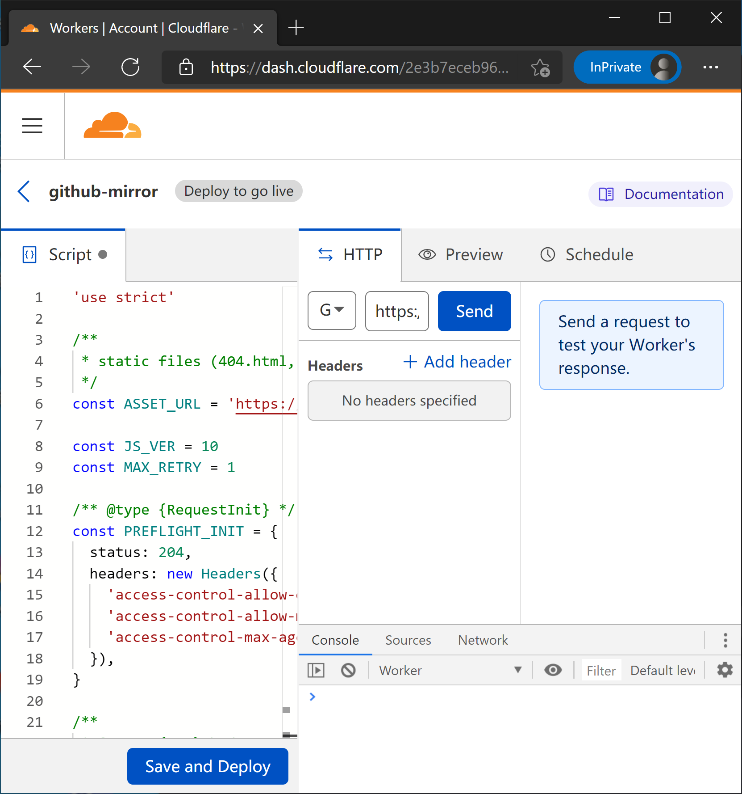

# github-proxy
En | [中](/README_ZH.md)<br><br>
 

## Introduction
A browser-side JS based online proxy implementation for Github.<br>
There have been some regions and countries that blocked the access to Github.com and its subpages. With this github proxy, you can:<br>
- set a mirror of Github.com
- set mirrors for your own github pages.

There's no servers needed. The only thing you need is just a `CloudFlare Workers` account. It's all free.<br>

## Instructions
1. Go to [https://dash.cloudflare.com/sign-up/workers](https://dash.cloudflare.com/sign-up/workers) and sign up an account.<br><br>
<br><br>
2. Create a Worker.<br><br>
<br><br>
3. Paste the code in [index.js](index.js) to the code box on the left, then click "Save and Deploy" and confirm it. You can change the subdomain in account settings and the second-subdomain in the upper left corner. Here, I named it "github-mirror".<br><br>
<br><br>
4. Click "Send" in the right box to check your worker's response.<br><br>
<br><br>
5. All is set. Enjoy the mirror site in `https://second-subdomain.subdomain.workers.dev`.<br><br>
<br><br>

## What's more
You can also set mirrors for your own github pages. Just change `https://github.com` into your github pages domain such as `https://katorly.github.io` at
```javascript
const ASSET_URL = 'https://github.com'
```
in instruction 3.<br>
<br>
You can also use your custom domains to set up the mirrors.<br>

## Notice
- DON'T attempt to sign in or login in mirrors, because it won't work.
- A free CloudFlare workers account includes up to <b>100k</b> requests per day. That means if the maximum amount of requests exceeded, your mirror will not longer work. But in fact, 100k requests per day is enough for personal use. You may upgrade to paid plan if you want.
- The code `index.js` in this repository comes from [https://github.com/EtherDream/jsproxy](https://github.com/EtherDream/jsproxy).
